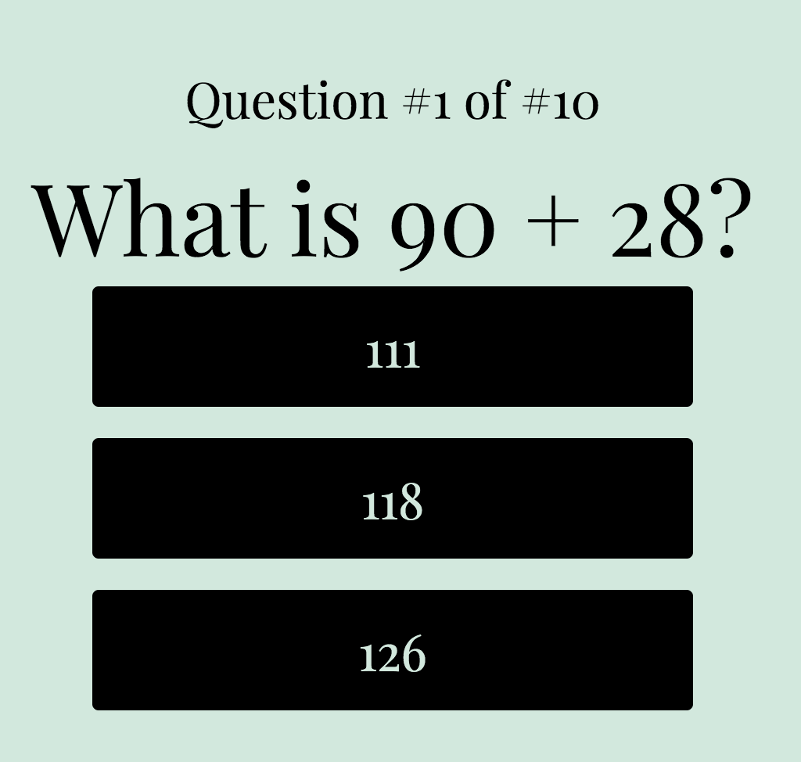
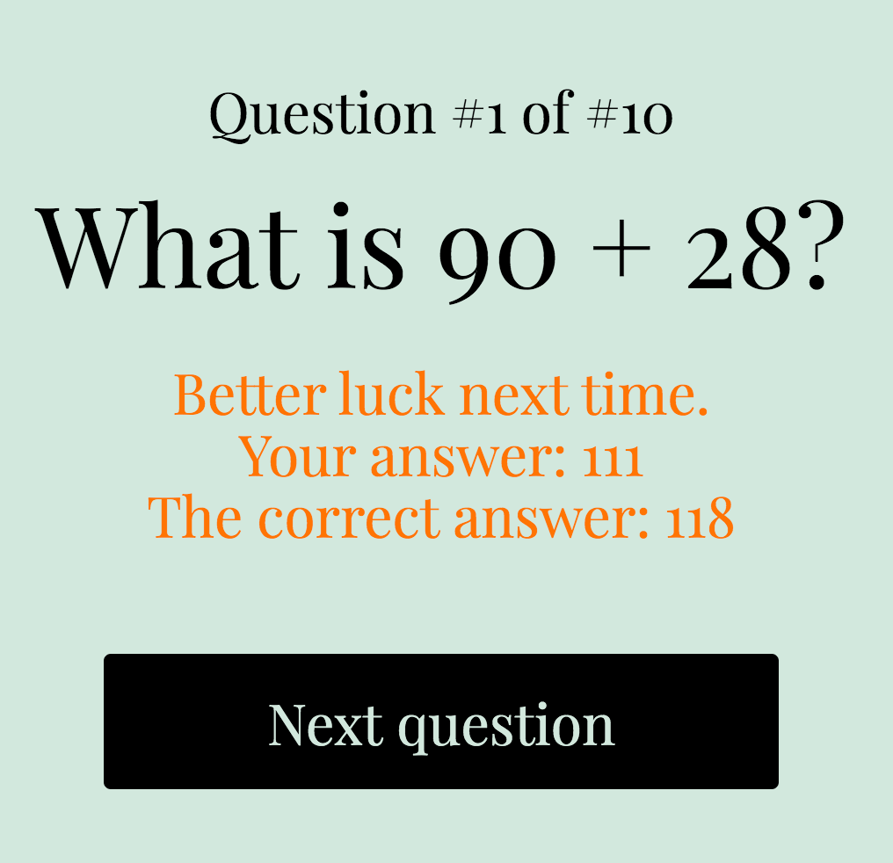
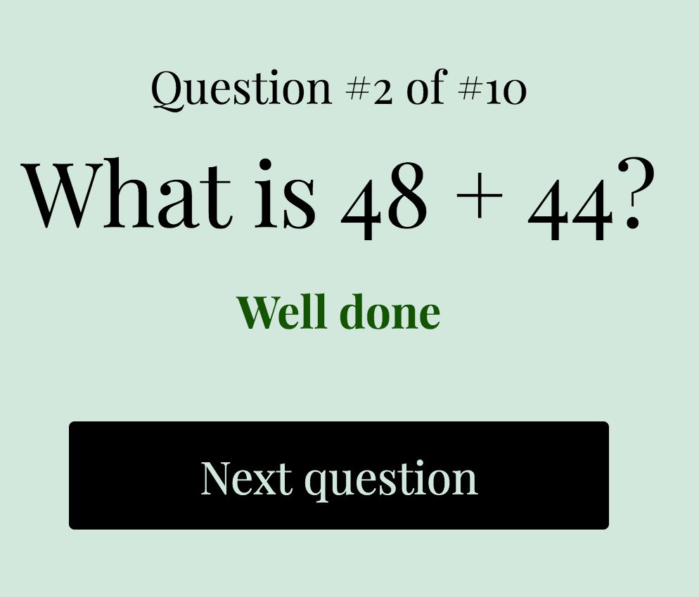
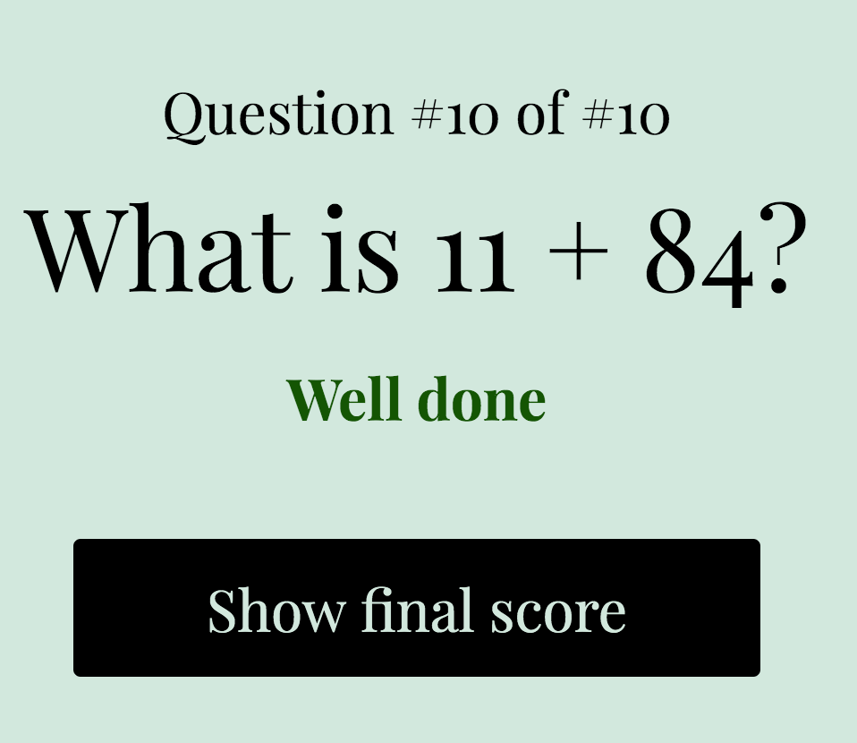
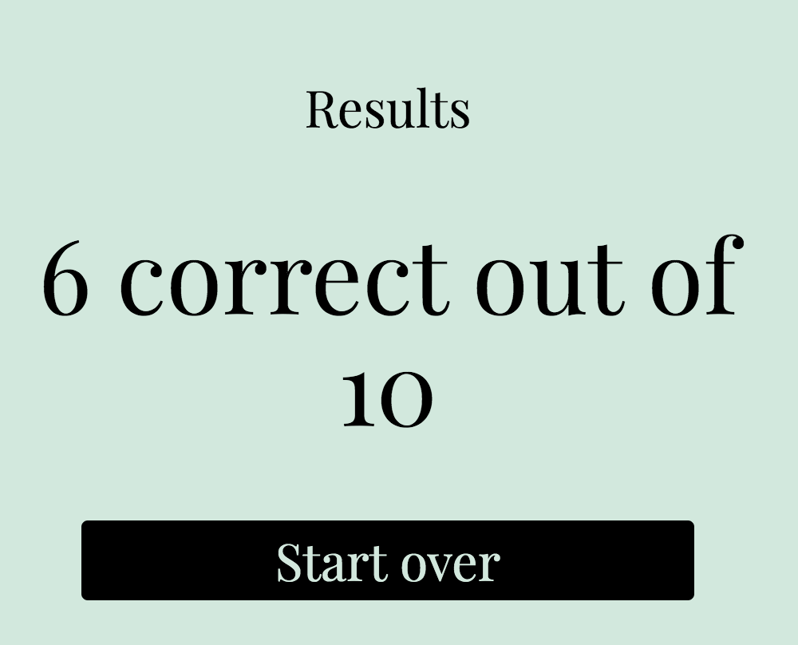

# A Math Additions Quiz app based on PHP, HTML & CSS
### PHP Team Treehouse TechDegree project #2

- [Specs from the math teacher](#specs-from-the-math-teacher)
- [What the app does](#what-the-app-does)
- [Tech used](#tech-used)
- [Folder & file structure](#folder--file-structure)

## Specs from the math teacher
- A teacher from a nearby school has been having trouble teaching addition to her students and wants to use an app to help them.
- The app should start with a question (e.g. “What is 48 + 12?”) and list three answer choices below the question.
- If a student picks the correct answer, the app should toast “Correct!”. Otherwise, it should toast “Incorrect”.
- The app should then display the next question.
- Once all questions have been answered, the app should display a final score.

*Note:*
- The questions should be generated automatically, but in one round all questions should be unique
- The complexity should be maximized: the addition outcome must always be smaller than 200
- The user should not be able to guess the correct answer (for example because it's always the value in the middle, while the 1st incorrect answer is lower and the 2nd is higher)
- The 2 incorrect answers shouldn't be equal and shouldn't be equal to the correct answer
- The answers should be randomized before they are shown, to avoid the correct answers is always on the 1st, 2nd or 3rd button

## What the app does
1. Start quiz

2. Incorrect answer

3. Correct answer

4. Final question

5. Results screen

## Tech used
#### In this app the following main concepts & languages are applied:
PHP | data persistence in sessions | loops | file handling | error handling | HTML | CSS

## Folder & file structure
#### The most important folders & files within this project:

      .
      ├── css                         # contains the css files                 
      ├── inc                         # contains the functions & question files
      ├── index.php                   # main screen of the quiz, which controls the questions, answers & feedback flow
      └── results.php                 # results screen when user answered all questions
